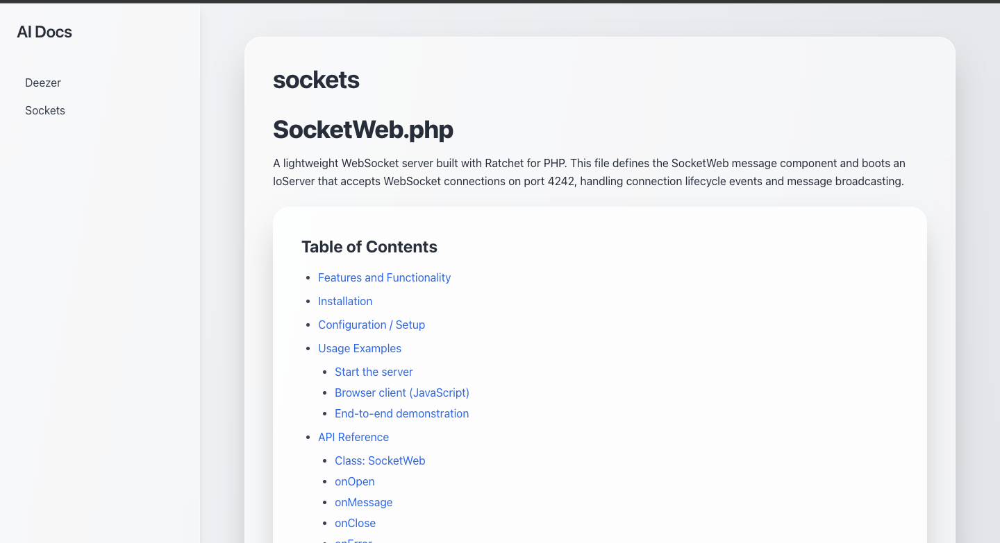
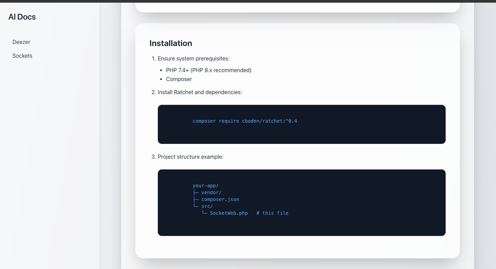
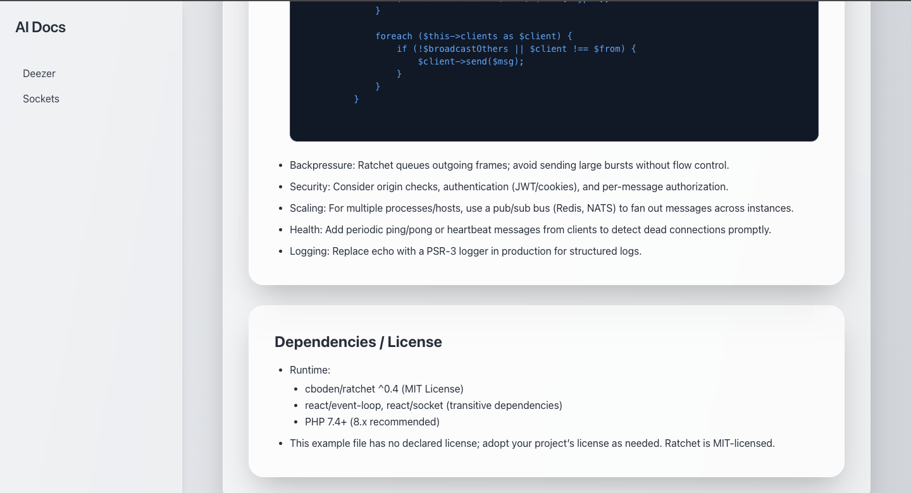

# Generate AI Documentation

GitHub Action that automatically generates professional, fully styled HTML documentation for source code using OpenAI GPT models.
Each file in the project is analyzed and transformed into a self-contained HTML documentation page with clear explanations, usage examples, and structured navigation.

---

## Features

* Automatically generate complete HTML documentation for all code files.
* Recursively scan directories; subfolders become documentation categories.
* Include detailed inline explanations for functions, classes, and modules.
* Automatically generate realistic usage examples for each function or class.
* Detect the programming language automatically (supports JavaScript, TypeScript, Python, and PHP).
* Maintain a consistent and modern Tailwind CSS HTML layout across all pages.
* Generate a sidebar with correct relative links between files and folders.
* Produce documentation that can be viewed directly in any browser.
* Fully reusable as a standalone GitHub Action with a user-provided OpenAI API key.

---

## How It Works

1. The action scans the specified source folder recursively.
2. Each supported file is sent to the OpenAI API with a documentation generation prompt.
3. The model returns a clean HTML snippet that includes explanations, examples, and structure.
4. The snippet is wrapped in a Tailwind CSS-based template with sidebar navigation.
5. All generated pages are saved in the `docs/` directory, ready for publishing or browsing locally.

---

## Usage

Add the following workflow file to your repository under `.github/workflows/generate-docs.yml`:

```yaml
name: "Generate Documentation"

on:
  workflow_dispatch:
    inputs:
      code_folder:
        description: "Path to the code folder to document"
        required: true
        default: "src"

jobs:
  generate-docs:
    runs-on: ubuntu-latest
    steps:
      - uses: actions/checkout@v4

      - name: Generate documentation
        uses: agasparo/ia-doc-maker@v2.1.0
        with:
          openai_api_key: ${{ secrets.OPENAI_API_KEY }}
          path: ${{ github.event.inputs.code_folder }}

      - name: Upload generated HTML documentation
        uses: actions/upload-artifact@v4
        with:
          name: generated-docs
          path: docs/
```

---

## Output Structure

After the workflow completes, a `docs/` folder is created with the following structure:

```
docs/
├─ index.html
├─ utils/
│  ├─ math.html
│  └─ string.html
└─ main.html
```

Each file includes:

* File title and overview.
* Table of contents and navigation sidebar.
* Features, configuration, and example usage sections.
* Fully styled code blocks with syntax highlighting.
* Detailed explanations for logic, parameters, and return values.

All generated pages share the same responsive Tailwind CSS design and can be opened directly in a browser.

---

## Supported Languages

| Language   | File Extension |
| ---------- | -------------- |
| JavaScript | `.js`          |
| TypeScript | `.ts`          |
| Python     | `.py`          |
| PHP        | `.php`         |

---

## Technical Overview

The generator is implemented in Node.js and uses the following stack:

* `@actions/core` for GitHub Actions input/output management
* `fs` and `path` for recursive directory scanning
* `openai` for API interaction with GPT models
* Tailwind CSS (via CDN) for consistent, modern styling

Each HTML page is self-contained and requires no external assets besides the Tailwind CDN.

---

## Local Usage

You can also generate documentation locally before running it in a workflow.

```bash
# Install dependencies
npm install

# Run documentation generation
node index.js
```

Set your OpenAI API key as an environment variable:

```bash
export OPENAI_API_KEY="your_api_key_here"
```

This will create a `/docs` folder in the current working directory.

---

## License

This project is distributed under the MIT License.
You are free to use, modify, and redistribute it under the same terms.

---

## Contributing

Contributions, feedback, and feature suggestions are welcome.
Please open an issue or submit a pull request if you would like to help improve this project.

## Images





